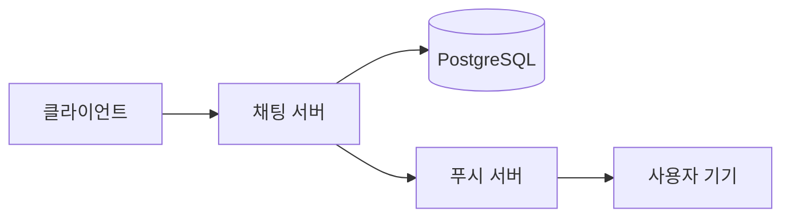

# 이 문서는

!!! note "스타일 확인용 예시 글"
    이 페이지 내용은 테마가 어떻게 보이는지 확인하려고 채워 넣은 예시입니다. 실제 글을 쓸 때 통째로 지우고 새로 쓰면 됩니다.

같은 요구사항을 여러 서버 아키텍처로 구현하고, 같은 조건에서 부하를 걸어 비교한 기록입니다. 여기서는 각 서버가 어떻게 코딩되었는지가 아니라 **어떤 구조로 되어 있고 왜 그렇게 골랐는지**를 다룹니다. 한글 문장이 어절 단위로 자연스럽게 줄바꿈되는지, 라틴 문자와 한글이 같은 자족으로 보이는지 확인하기 위한 문단이기도 합니다.

## 무엇을 다루나

채팅 한 건이 들어오면 서버는 저장을 마친 뒤 그 방에 있는 모든 사용자의 기기로 푸시를 보냅니다. 사용자가 열 명이고 기기가 하나씩이면 채팅 한 건당 푸시가 열 번 나갑니다. 이 팬아웃이 이 프로젝트의 전부라고 해도 과언이 아닙니다.

### 다루는 것

- 요청이 들어와서 푸시가 나가기까지의 경로
- 구현마다 달라지는 스레드 모델과 그 결과
- 측정 환경을 어떻게 격리했는지

### 다루지 않는 것

- 프레임워크 사용법이나 문법
- 클래스 단위의 구현 설명

> 구조를 고른 이유가 남아 있지 않으면, 나중에 같은 고민을 처음부터 다시 하게 됩니다.

## 흐름 한눈에 보기



요청 하나가 지나가는 경로는 짧지만, 마지막 단계가 사용자 수만큼 반복됩니다.

### 순서가 중요한 이유

저장이 확정되기 전에 푸시를 보내면, 롤백된 메시지가 사용자에게 도착하는 창이 열립니다.

```java
@Transactional
public UUID send(SendMessageCommand command) {
    Message saved = messageRepository.save(command.toEntity());
    return saved.getPk();
}
// 팬아웃은 커밋이 끝난 뒤에 시작한다
```

#### 예외를 삼키지 않기

푸시 한 건이 실패해도 나머지는 계속 나가야 하지만, 실패했다는 사실 자체는 남아야 합니다.

## 실행해 보기

로컬에서 스택을 띄우는 명령입니다.

```bash
cd perf
./run-local.sh mvc smoke
```

프로파일을 바꾸면 부하 크기가 달라집니다.

```bash
./run-local.sh webflux load
```

### 설정 예시

```yaml
spring:
  datasource:
    hikari:
      maximum-pool-size: 20
```

## 구현별 차이

| 구현 | 팬아웃 방식 | 스레드 모델 |
| --- | --- | --- |
| MVC + JPA | 순차 | 플랫폼 스레드 |
| MVC 병렬 | 가상 스레드 | 가상 스레드 |
| WebFlux + jOOQ | 논블로킹 | 이벤트 루프 |
| Go | 고루틴 | 고루틴 |

같은 요구사항을 만족하지만 부하가 올라갈 때 무너지는 지점이 서로 다릅니다.

### 측정할 때 주의한 것

1. 부하기와 대상 서버를 같은 장비에 두지 않기
2. 매 측정 전에 데이터를 같은 상태로 되돌리기
3. 워밍업 구간을 결과에서 빼기

!!! warning "비용 주의"
    클라우드 자원 중에는 켜 두기만 해도 시간당 과금되는 것들이 있습니다. 측정이 끝나면 반드시 내려야 합니다.

## 남은 이야기

여기까지가 예시입니다. 실제 내용은 왼쪽 목차의 각 문서에 나눠 씁니다. `inline code` 와 [링크](#) 가 본문에서 어떻게 보이는지도 이 문단에서 확인할 수 있습니다.
